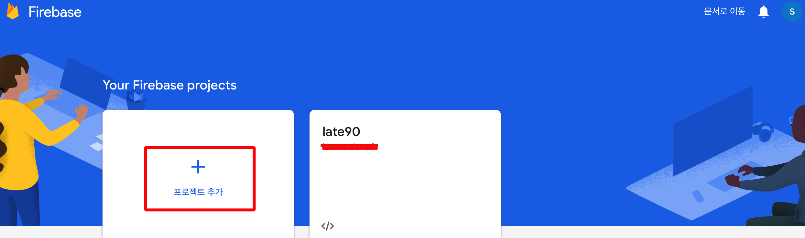
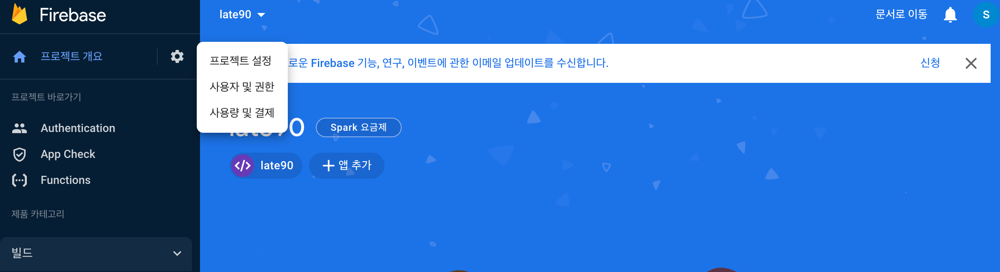
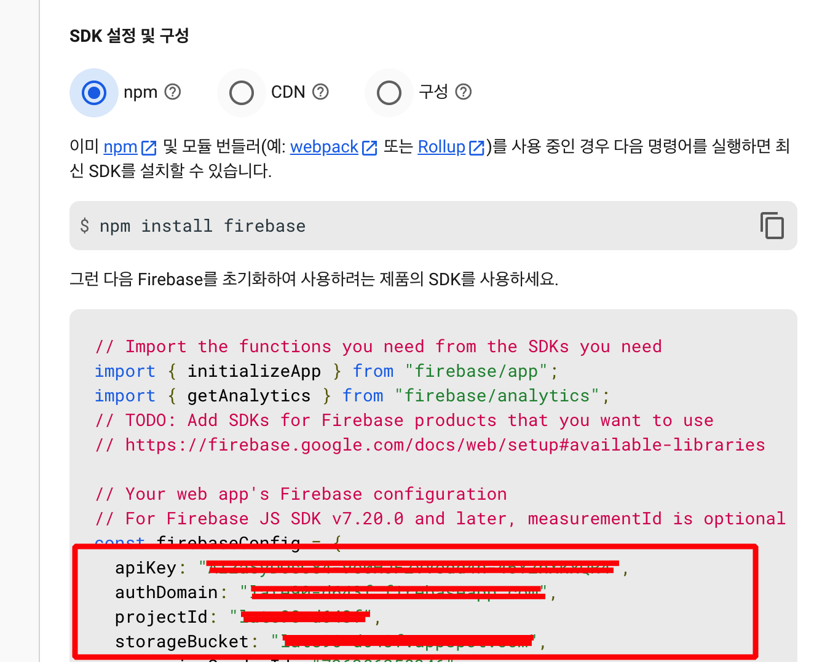

## 전제조건

Docusaurus, [Firebase](https://firebase.google.com/docs/web/setup) 지식 필요

## Install packages

    npm install firebase
    npm i firebase docusaurus2-dotenv

With the above command, we will install firebase SDK for the web and docusaurus2-dotenv for using the env file.

## Update docusaurus.config.js

```
//
plugins: [
  [
    'docusaurus2-dotenv',
    {
      systemvars: true
    }
  ]
],
```

## Docusaur Swizzling

import Tabs from "@theme/Tabs";
import TabItem from "@theme/TabItem";

<Tabs>
<TabItem value="방식1. 헤더에 login 버튼" label="방식1. 헤더에 login 버튼" default>

```jsx title="src/theme/ColorModeToggle/index.js"
import ColorModeToggle from "@theme-original/ColorModeToggle";
import React, { useState } from "react";
import { signInWithGoogle, logout, auth } from "../../theme/firebase";
import "../../css/login.css";
import Loading from "../Loading";

export default function ColorModeToggleWrapper(props) {
  console.log("theme/color/index.js");

  const [userAuth, setUserAuth] = useState(null);
  const [authLoading, setAuthLoading] = useState(true);

  auth.onAuthStateChanged(async function (user) {
    if (user !== null) {
      setUserAuth(user);
    }

    setAuthLoading(false);
  });

  const isAllow = () => {
    return userAuth?.email;
  };

  if (authLoading) {
    return (
      <>
        <Loading />
      </>
    );
  }

  return (
    <>
      {isAllow() ? (
        <a
          style={{ marginRight: 15, cursor: "pointer", color: "#222222" }}
          onClick={() => logout(() => window.location.reload())}
        >
          Logout
        </a>
      ) : (
        <button
          style={{
            marginRight: 15,
            cursor: "pointer",
            color: "#222222",
            border: "0px",
            backgroundColor: "white",
            fontSize: "12pt",
          }}
          onClick={signInWithGoogle}
        >
          Login
        </button>
      )}
      <ColorModeToggle {...props} />
    </>
  );
}
```

</TabItem>
<TabItem value="방식2. 브라우저 첫화면에 login 버튼" label="방식2. 브라우저 첫화면에 login 버튼">

```jsx title="src/theme/Root.js"
import React, { useState } from "react";
import { signInWithGoogle, logout, auth } from "./firebase";
import "../css/login.css";
import Loading from "./Loading";

// Default implementation, that you can customize
export default function Root({ children }) {
  const [userAuth, setUserAuth] = useState(null);
  const [authLoading, setAuthLoading] = useState(true);

  auth.onAuthStateChanged(async function (user) {
    if (user !== null) {
      setUserAuth(user);
    }

    setAuthLoading(false);
  });

  const isAllow = () => {
    return userAuth?.email;
  };

  if (authLoading) {
    return (
      <>
        <Loading />

        <div style={{ display: "none" }}>{children}</div>
      </>
    );
  }

  return (
    <React.Fragment>
      {isAllow() ? (
        <>{children}</>
      ) : (
        <div className="login">
          <div className="login__container">
            <button
              className="login__btn login__google"
              onClick={signInWithGoogle}
            >
              Login with Google
            </button>
          </div>
        </div>
      )}
    </React.Fragment>
  );
}
```

```jsx title="src/theme/ColorModeToggle/index.js"
import React from "react";
import ColorModeToggle from "@theme-original/ColorModeToggle";
import { logout } from "../firebase";

export default function ColorModeToggleWrapper(props) {
  return (
    <>
      <a
        style={{ marginRight: 15, cursor: "pointer", color: "#222222" }}
        onClick={() => logout(() => window.location.reload())}
      >
        Logout
      </a>
      <ColorModeToggle {...props} />
    </>
  );
}
```

</TabItem>
</Tabs>

```jsx title="src/theme/Loading.js"
import React from "react";
import PropTypes from "prop-types";

const Loading = (props) => {
  return (
    <div className="overlay">
      <div className="overlayDoor" />
      <div className="overlayContent">
        <div className="loader">
          <div className="inner" />
        </div>
      </div>
    </div>
  );
};

Loading.propTypes = {};

export default Loading;
```

```jsx title="src/theme/firebase.js"
import * as firebase from "firebase/app";
import "firebase/storage";
import "firebase/auth";
import {
  GoogleAuthProvider,
  getAuth,
  signInWithPopup,
  signOut,
} from "firebase/auth";

const app = firebase.initializeApp({
  apiKey: process.env.FIREBASE_API_KEY,
  authDomain: process.env.FIREBASE_AUTH_DOMAIN,
  projectId: process.env.FIREBASE_PROJECT_ID,
  storageBucket: process.env.FIREBASE_STORAGE_BUCKET,
});

export const auth = getAuth(app);
export const googleProvider = new GoogleAuthProvider();

export const logout = (afterAction = () => {}) => {
  signOut(auth).then((r) => afterAction(null));
};

export const signInWithGoogle = async () => {
  try {
    const res = await signInWithPopup(auth, googleProvider);
  } catch (err) {
    console.error(err);
    alert(err.message);
  }
};
```

```jsx title="src/css/login.css"
.login {
  height: 100vh;
  width: 100vw;
  display: flex;
  align-items: center;
  justify-content: center;
}
.login__container {
  display: flex;
  flex-direction: column;
  text-align: center;
  padding: 30px;
}
.login__textBox {
  padding: 10px;
  font-size: 18px;
  margin-bottom: 10px;
}
.login__btn {
  padding: 10px;
  font-size: 18px;
  margin-bottom: 10px;
  border: none;
  color: white;
  background-color: black;
}
.login__google {
  background-color: #4285f4;
}
.login div {
  margin-top: 7px;
}
.overlay {
  position: fixed;
  top: 0;
  left: 0;
  width: 100%;
  height: 100%;
  z-index: 100000000;
}
.overlay .overlayDoor:before, .overlay .overlayDoor:after {
  content: '';
  position: absolute;
  width: 50%;
  height: 100%;
  background: #111;
  transition: 0.5s cubic-bezier(0.77, 0, 0.18, 1);
  transition-delay: 0.8s;
}
.overlay .overlayDoor:before {
  left: 0;
}
.overlay .overlayDoor:after {
  right: 0;
}
.overlay.loaded .overlayDoor:before {
  left: -50%;
}
.overlay.loaded .overlayDoor:after {
  right: -50%;
}
.overlay.loaded .overlayContent {
  opacity: 0;
  margin-top: -15px;
}
.overlay .overlayContent {
  position: relative;
  width: 100%;
  height: 100%;
  display: flex;
  justify-content: center;
  align-items: center;
  flex-direction: column;
  transition: 0.5s cubic-bezier(0.77, 0, 0.18, 1);
  background: #fff;
}
.overlay .overlayContent .skip {
  display: block;
  width: 130px;
  text-align: center;
  margin: 50px auto 0;
  cursor: pointer;
  color: #fff;
  font-family: 'Nunito';
  font-weight: 700;
  padding: 12px 0;
  border: 2px solid #fff;
  border-radius: 3px;
  transition: 0.2s ease;
}
.overlay .overlayContent .skip:hover {
  background: #ddd;
  color: #444;
  border-color: #ddd;
}
.loader {
  width: 128px;
  height: 128px;
  border: 3px solid #222222;
  border-bottom: 3px solid transparent;
  border-radius: 50%;
  position: relative;
  animation: spin 1s linear infinite;
  display: flex;
  justify-content: center;
  align-items: center;
}
.loader .inner {
  width: 64px;
  height: 64px;
  border: 3px solid transparent;
  border-top: 3px solid #222222;
  border-radius: 50%;
  animation: spinInner 1s linear infinite;
}
@keyframes spin {
  0% {
    transform: rotate(0deg);
  }
  100% {
    transform: rotate(360deg);
  }
}
@keyframes spinInner {
  0% {
    transform: rotate(0deg);
  }
  100% {
    transform: rotate(-720deg);
  }
}
```

## .env file

```
FIREBASE_API_KEY=
FIREBASE_AUTH_DOMAIN=
FIREBASE_PROJECT_ID=
FIREBASE_STORAGE_BUCKET=
```

위 키값을 입력해주기 위해서는 아래 스샷을 참고.


로그인 후 `프로젝트 추가`


`톱니바퀴` 클릭 후 `프로젝트 설정` 클릭 후 `스크롤 하단`으로 내리면


캡처 제일 하단 4줄 필요한 key값 확인할 수 있다.

출처 :https://medium.com/@thomasdevshare/docusaurus-authentication-with-firebase-c824da24bc51
