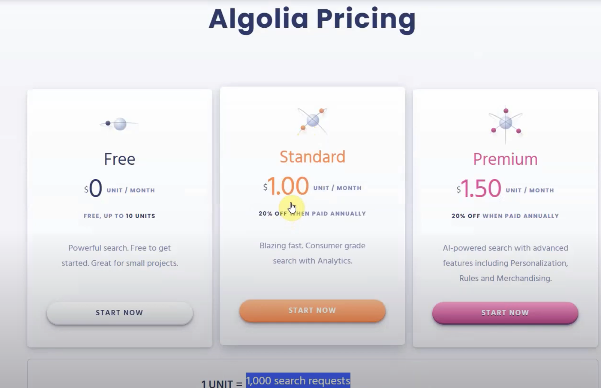
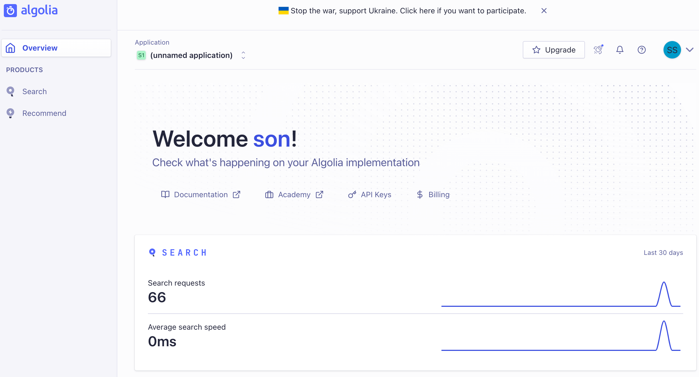
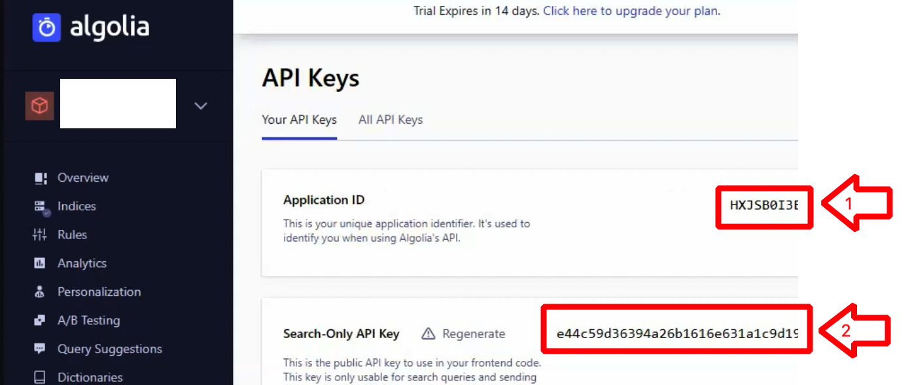
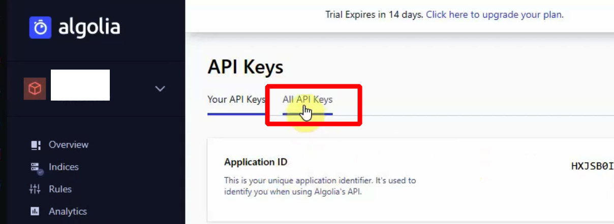
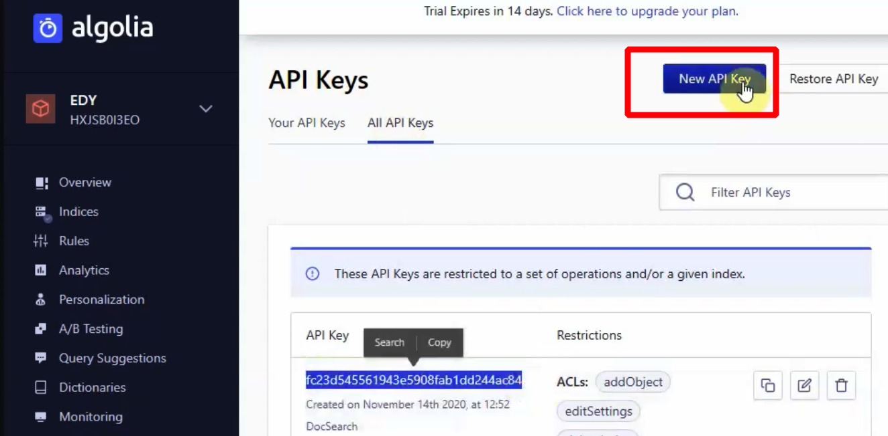
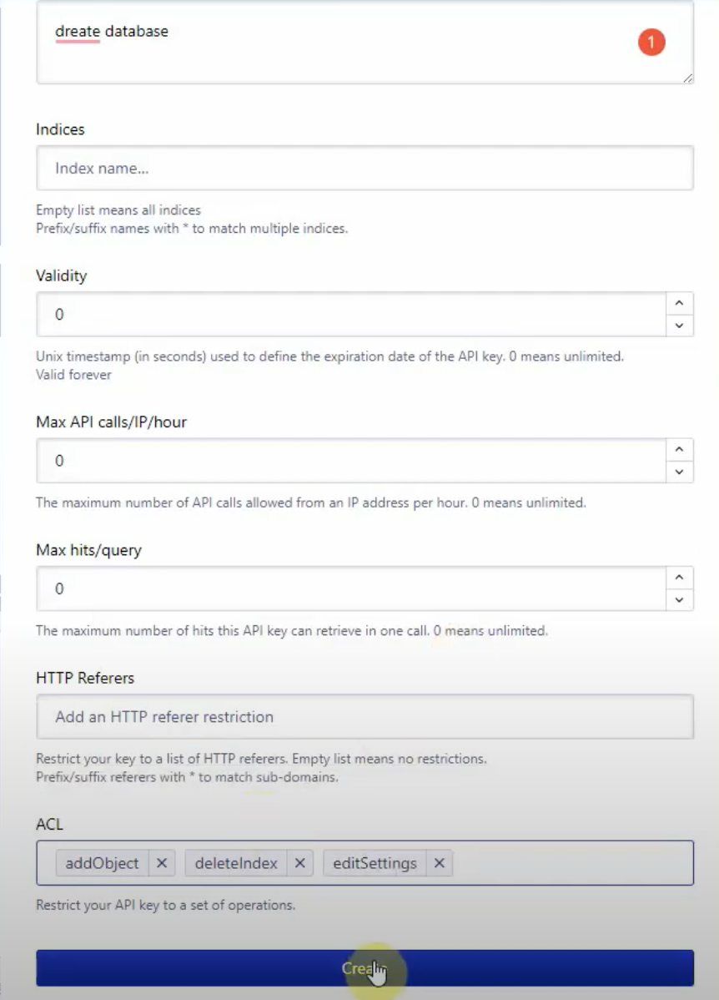
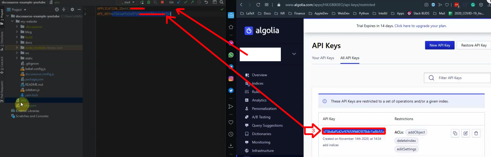
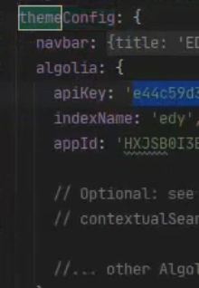
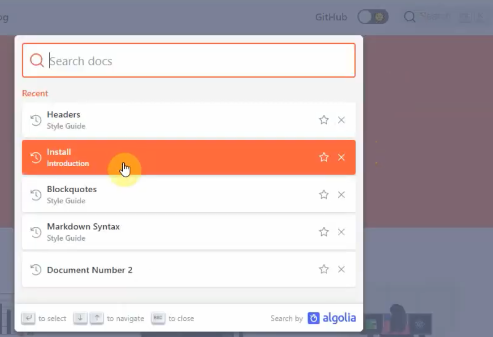

## algolia 가입

1 unit = 1000 건 조회.  
무료는 10unit까지.  
즉, 1만 건 조회까지는 무료이다.  
https://www.algolia.com/users/sign_in


조회량은 확인 가능하다.(현재 66회)


## Get API keys



- API key(1번째), API key(2번째) 생성

## Create All API Keys




`new API key`클릭  

각 칸대로 입력.


- API key(3번째) 생성
- .env파일을 최상위 폴더에 생성.
- 생성된 API key(1번), API key(3번) 입력.
- ```jsx
  APPLICATION_ID = API key(1번)
  API_KEY = API key(3번)
  ```

## Create Config.json

- 최상위 폴더에 config.json 파일 생성
- ```jsx
    // highlight-start
  {
    "index_name": "수정해주세요.",
    "start_urls": ["https://당신의 url로 변경해주세요.com/"],
    "sitemap_urls": ["https://당신의 url로 변경해주세요.com/sitemap.xml"],
    // highlight-end
    "sitemap_alternate_links": true,
    "stop_urls": ["/tests"],
    "selectors": {
      "lvl0": {
        "selector": "(//ul[contains(@class,'menu__list')]//a[contains(@class, 'menu__link menu__link--sublist menu__link--active')]/text() | //nav[contains(@class, 'navbar')]//a[contains(@class, 'navbar__link--active')]/text())[last()]",
        "type": "xpath",
        "global": true,
        "default_value": "Documentation"
      },
      "lvl1": "header h1",
      "lvl2": "article h2",
      "lvl3": "article h3",
      "lvl4": "article h4",
      "lvl5": "article h5, article td:first-child",
      "lvl6": "article h6",
      "text": "article p, article li, article td:last-child"
    },
    "strip_chars": " .,;:#",
    "custom_settings": {
      "separatorsToIndex": "_",
      "attributesForFaceting": ["language", "version", "type", "docusaurus_tag"],
      "attributesToRetrieve": [
        "hierarchy",
        "content",
        "anchor",
        "url",
        "url_without_anchor",
        "type"
      ]
    },
    "conversation_id": ["833762294"],
    "nb_hits": 46250
  }
  ```

- 위의 하이라이트 3줄 수정해서 쓰면 된다.
- 알고리아에서의 index name을 쓰고 배포하는 url 주소를 써주자.

## Run the crawl from the Docker image

import Tabs from "@theme/Tabs";
import TabItem from "@theme/TabItem";

<Tabs>
<TabItem value="Mac" label="Mac" default>

    brew install jq

    brew install --cask docker

    docker run -it --env-file=.env -e "CONFIG=$(cat ./config.json | jq -r tostring)" algolia/docsearch-scraper

</TabItem>
<TabItem value="Window" label="Window">

    choco install jq

    choco install docker-desktop

    docker run -it --env-file=.env -e "CONFIG=$(cat ./config.json | jq -r tostring)" algolia/docsearch-scraper

</TabItem>
</Tabs>

## docusaurus.config.js 내용 추가

- 여기서는 API key `1`,`2`번째를 순서대로 넣어주고 indexName을 설정해 주자.

```jsx title="docusaurus.config.js"
algolia: {
        // highlight-start
        // 알골리아에서 제공한 appId를 사용하세요.
        appId: "",

        // 공개 API 키: 커밋해도 문제가 생기지 않습니다.
        apiKey: "",

        indexName: "",
        // highlight-end
        // 옵션: 아래 문서를 참고
        contextualSearch: true,

        // 옵션: history.push 대신 window.location을 통해 탐색해야 하는 도메인을 지정합니다. 여러 문서 사이트를 크롤링하고 window.location.href를 사용하여 해당 사이트로 이동하려는 경우에 유용한 알골리아 설정입니다.
        externalUrlRegex: "external\\.com|domain\\.com",

        // 옵션: 알골리아 검색 파라미터
        searchParameters: {},

        // 옵션: 기본적으로 활성화된 검색 페이지 경로(비활성화하려면 `false`로 설정)
        searchPagePath: "search",

        //... 다른 알골리아 파라미터
      },
```

- docusaurus.config.js 에서 `themeConfig:{안에 넣어주자}`  
  

## end


