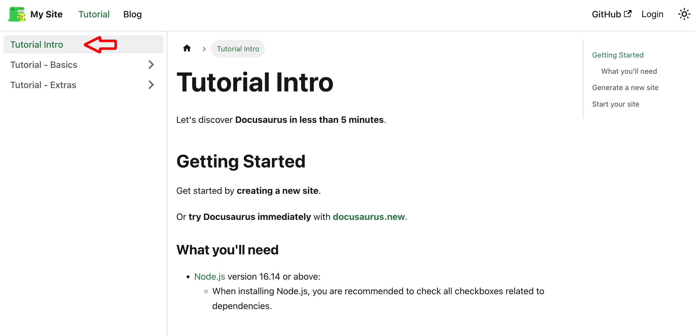
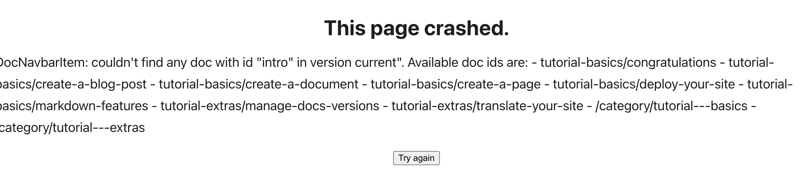
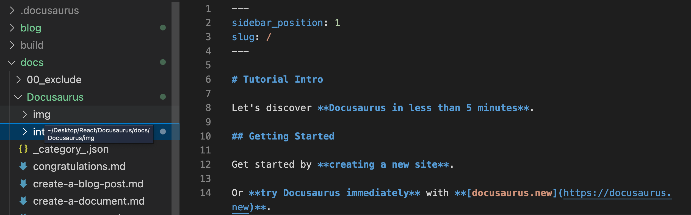
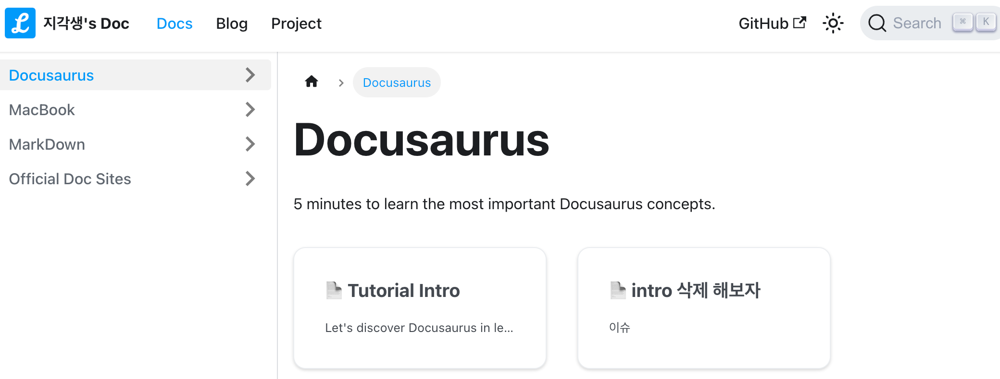

import CodeBlock from "@theme/CodeBlock";
import Tabs from "@theme/Tabs";
import TabItem from "@theme/TabItem";

## 이슈

여기서는 좌측 카테고리에 intro.md 파일을 삭제해 볼 것이다.



그냥 삭제해버리면 아래와 같이 충돌이 발생한다.


## 해결법

<Tabs>
  <TabItem value="수정 전" label="수정 전" default>

```jsx title="docusaurus.config.js"
themeConfig:
  /** @type {import('@docusaurus/preset-classic').ThemeConfig} */
  ({
    navbar: {
      title: "My Site",
      logo: {
        alt: "My Site Logo",
        src: "img/logo.svg",
      },
      items: [
        {
           // highlight-start
          type: "doc",
          docId: "intro",
           // highlight-end
          position: "left",
          label: "Tutorial",
        },
```

  </TabItem>
  <TabItem value="수정 후" label="수정 후">

### config 수정

```jsx title="docusaurus.config.js"
themeConfig:
    /** @type {import('@docusaurus/preset-classic').ThemeConfig} */
    ({
      navbar: {
        title: "지각생's Doc",
        logo: {
          alt: "지각생's Doc Logo",
          src: "img/android-chrome-192x192.png",
        },
        items: [
          //{ type: "docsVersionDropdown" },
          {
            // highlight-next-line
            to: "/docs",
            //routeBasePath: '/'
            position: "left",
            label: "Docs",
          },
```

---

### slug 설정

들어오면 처음으로 보여줄 파일에 프론트매터

```
    ---
    slug:/
    ---
```

설정을 해준다.



---

### 완료 후 화면

(웹 발전해가며 바뀐 모습들도 있다..)



  </TabItem>
</Tabs>
