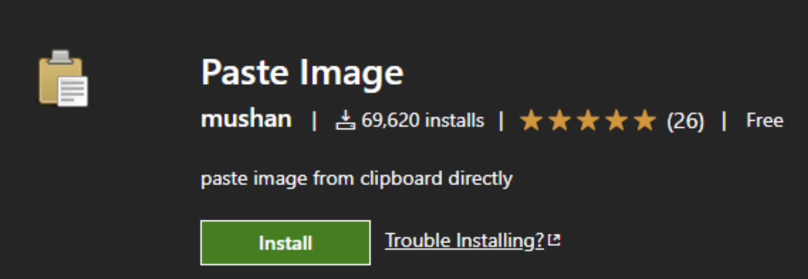

import Tabs from "@theme/Tabs";
import TabItem from "@theme/TabItem";

## paste image

### 사용 방법

<Tabs>
  <TabItem value="Mac" label="Mac" default>
    사용하고자 하는 이미지 캡처 : Cmd+Shift+4
      Md 파일에 붙여넣기 : Cmd+alt+V
  </TabItem>
  <TabItem value="window" label="window">
    사용하고자 하는 이미지 캡처 : Win+shift+s
      Md 파일에 붙여넣기 : Ctrl+Alt+V
  </TabItem>
</Tabs>
